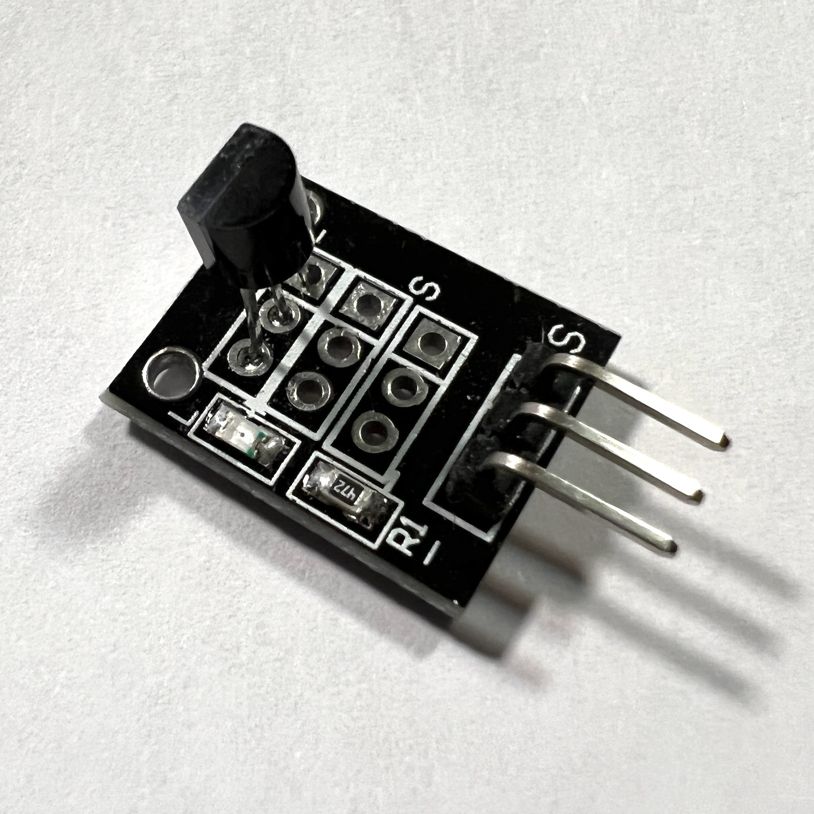
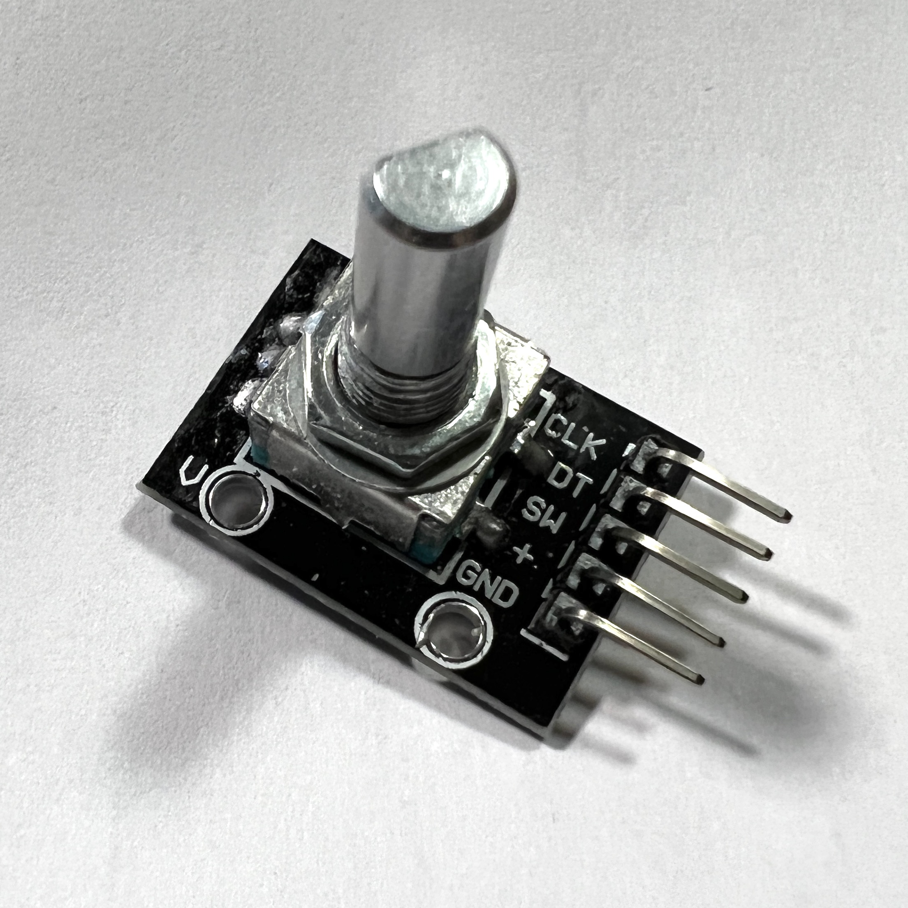
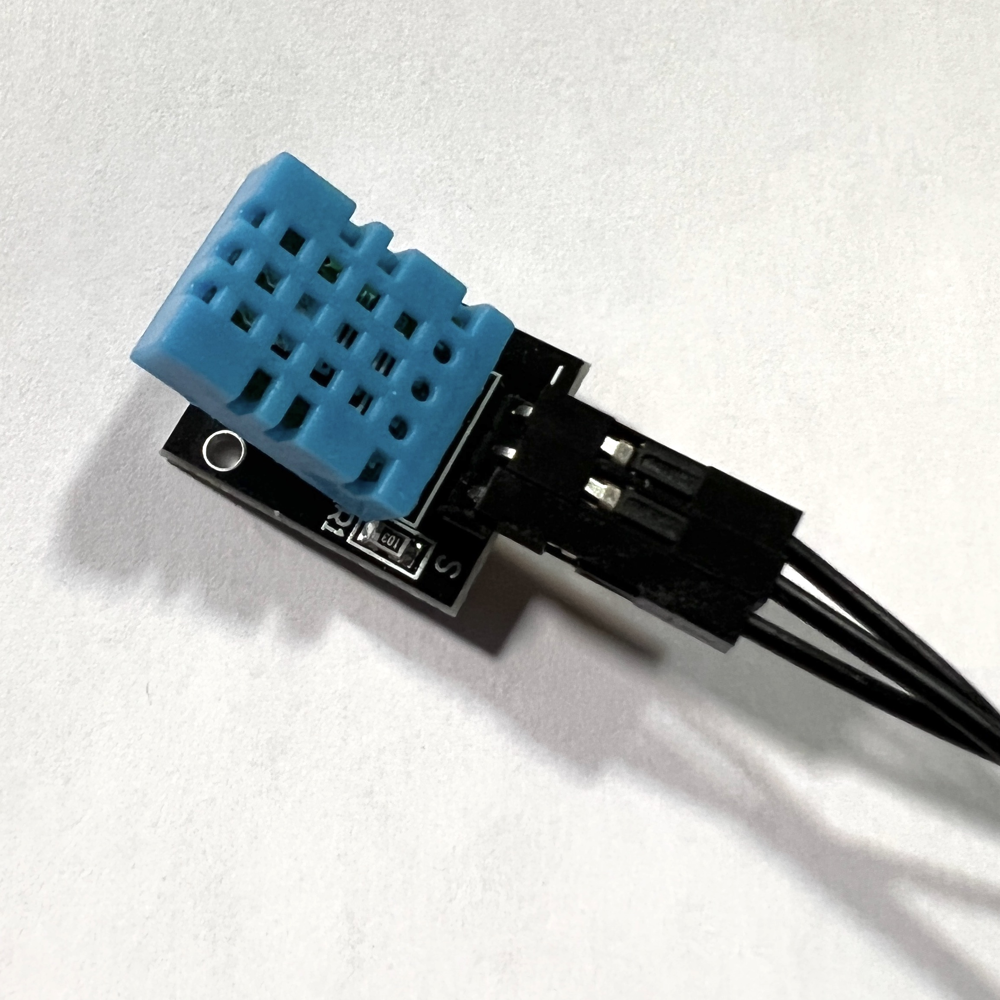

# ESP32 projects

## ESP32 Dev Board

### Pinout Diagram
https://docs.espressif.com/projects/esp-idf/en/latest/esp32/_images/esp32-devkitC-v4-pinout.png

## DS18B20 Digital Thermometer

### Code
[Arduino sketch (.INO)](digital_thermometer/digital_thermometer.ino)

### Product Page
https://www.maximintegrated.com/en/products/sensors/DS18B20.html

### Datasheet
https://datasheets.maximintegrated.com/en/ds/DS18B20.pdf

### YouTube Video
(Not mine)

https://www.youtube.com/watch?v=Y1__vmkr8-g

### Wiring Diagram
https://randomnerdtutorials.com/esp32-ds18b20-temperature-arduino-ide/

## Rotary Encoder

### Code
[Arduino sketch (.INO)](rotaryEncoder/rotaryEncoder.ino)

## SR04 Ultrasonic (Distance) Sensor

### Code
[Arduino sketch (.INO)](distance/distance.ino)

### Tutorial
https://lastminuteengineers.com/arduino-sr04-ultrasonic-sensor-tutorial/

## DHT11 Temperature and Humidity Sensor

### Code
[Arduino sketch (.INO)](rotaryEncoder/rotaryEncoder.ino)

## AH49E Linear Hall-Effect IC

### Code
None yet

### Datasheet
https://www.diodes.com/assets/Datasheets/AH49E.pdf

## MPSA13 NPM Transistor

### Code
None yet

### Datasheet
https://www.nteinc.com/specs/original/MPSA13_14.pdf

## 3144 Hall Sensor

### Code
[Arduino sketch (.INO)](hall_sensor_3144/hall_sensor_3144.ino)

